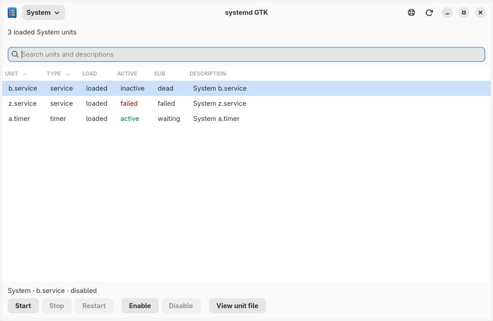

# systemd GTK


A native Linux desktop app for browsing and managing systemd units, built with
Rust, Relm4, GTK 4, and libadwaita.

Search loaded units, inspect their state and configuration, and manage either
the system manager or your current user's manager. Changes made elsewhere
appear automatically through D-Bus notifications.



## What it does

- Sortable, searchable unit table with an explicit unit-type column and textual
  state indicators; light, dark, and high-contrast-aware styling.
- Start, stop, restart, enable, and disable eligible units.
- Confirm disruptive actions with the unit name and manager scope.
- Read unit fragments and drop-ins in a separate, read-only window.
- Track job completion, report failures, and reconnect after a lost connection.

This is an early-stage administration tool. **Run it as your normal user, not
root.** Privileged system changes use your desktop's polkit authentication
agent. The app never collects passwords.

## Requirements

Linux with systemd and D-Bus, GTK **4.22+**, libadwaita **1.9+**, and GLib
**2.88+**. These are the GNOME 50 library requirements; the GNOME desktop itself
is not required. Building requires Rust **1.98+**, a C toolchain, pkg-config,
and the libraries' development files, including `glib-compile-resources`.
The checkout pins Rust 1.98.0 through rustup.

On Arch Linux:

```sh
sudo pacman -S --needed base-devel rustup gtk4 libadwaita dbus desktop-file-utils
```

For privileged system operations, install polkit and run an authentication
agent supplied by your desktop. User scope controls only the current user.

## Install

### Arch Linux: package your local checkout

From the repository root:

```sh
bash scripts/package-arch.sh --install
```

This snapshots the current source **including uncommitted changes**, builds and
tests a package, then asks pacman to install it. The launcher, icon, binary,
and license are managed by pacman. Do not run the script as root; makepkg
requests elevated permissions only when needed for dependencies/installation.

Use `bash scripts/package-arch.sh` to build without installing, or
`--prepare-only` to inspect the source archive and PKGBUILD. Workspaces and
packages remain under `target/arch-packages/`; Cargo's build cache is reused.

`build/aur/PKGBUILD` is a separate VCS recipe for AUR maintenance. It builds
the upstream Git checkout, **not local edits**. These changes must be available
upstream before that recipe can build the new version. No AUR submission is
performed by this repository's helper. Generate its metadata with
`cd build/aur && makepkg --printsrcinfo > .SRCINFO` before submitting it.

### Cargo: binary-only installation

Install the native requirements above first, then:

```sh
cargo install --path .
```

Ensure Cargo's bin directory (normally `~/.cargo/bin`) is on your PATH.
Once this version is pushed upstream, it can also be installed with:

```sh
cargo install --git https://github.com/Journeycorner/systemd-gtk.git
```

Cargo needs a source: `--path .` selects this checkout; a bare `cargo install`
does not mean the current project. These instructions do not require or imply a
crates.io release. No profile flag is necessary: installation uses release by
default, with ThinLTO and stripped symbols configured in Cargo.toml.

Local builds (including `cargo install --path .` and the Arch recipes) default
to `target-cpu=native` via `.cargo/config.toml`. This also applies to debug
builds: stable Cargo does not support profile-specific rustflags. Binaries may
require this machine's CPU features; do not distribute them to other machines
without rebuilding for a suitable CPU baseline. For portable x86-64 builds,
override with `RUSTFLAGS='-C target-cpu=x86-64' cargo build --release`.
Cargo ignores repository configuration for Git/registry installs, so those
retain ThinLTO but use the caller's CPU configuration. Use the checkout install
above for automatic native tuning.

Add `--locked` when you want the dependency versions recorded in Cargo.lock.
CI and packaging enforce it; it does not mean offline.

Cargo installs only the executable, not a complete desktop application. For the
binary, launcher, and icon together, use `bash scripts/package-arch.sh --install`.
The application contains no installation command, and build scripts do not
modify your desktop.

To remove a Cargo installation, run `cargo uninstall systemd-gtk`. If you used
the former self-registration command, its old files may remain:
`applications/com.journeycorner.systemd-gtk.desktop` and
`icons/hicolor/512x512/apps/com.journeycorner.systemd-gtk.png` in your user data
directory (normally `~/.local/share`). Remove those legacy files when switching
to the Arch package so the user launcher does not shadow the system launcher.

## Develop and run

```sh
cargo run --locked
```

The icon is embedded and appears inside the app even without installation.
Shell/dock integration requires the matching desktop entry and icon installed
by packaging; an uninstalled development build may not have a shell icon,
particularly on Wayland.

Choose **System** or **User** in the header. Ctrl+F focuses search, Ctrl+R
refreshes, and Enter opens a unit file when the table has focus. The help
button lists keyboard shortcuts.

## Scope and safety

The table shows **loaded units**, not every installed-but-unloaded unit file.
Unit files are read from disk using your permissions, including drop-ins
reported by the selected manager. This is not a unit editor or journal viewer.

Enablement and runtime state are independent: enabling does not start a unit;
disabling does not stop it. Systemd may also operate on dependencies.

An operation timeout means its outcome is unknown: the job may still complete.
Inspect the unit's state before retrying. The app does not automatically replay
mutations. Disconnected tables are marked stale and mutation controls disabled.

## Test and contribute

```sh
cargo fmt --all -- --check
cargo clippy --locked --all-targets --all-features -- -D warnings
cargo test --locked
bash scripts/test-ui.sh
cargo build --locked --release
bash scripts/test-packaging.sh
```

Headless UI tests additionally require Xvfb and xauth:
`sudo pacman -S --needed xorg-server-xvfb xorg-xauth mesa`.

Tests use private D-Bus services and an injected UI backend; **they do not
control host units**. Coverage includes action eligibility, job outcomes,
scope changes, connection recovery, dialogs, desktop integration, and a
3,000-unit table. Packaging checks stage files without installing to the host.
See [testing and manual validation](docs/testing.md) for the full checklist.

The architecture has three main boundaries: plain Rust state in `src/model.rs`,
asynchronous typed D-Bus access in `src/backend/`, and Relm4 components in
`src/ui/`. GTK stays on the main thread; backend commands return owned data.
Public modules support tests, not a stable library API.

See [UI decisions, research, and icon provenance](docs/design.md).
Licensed under [0BSD](LICENSE).
